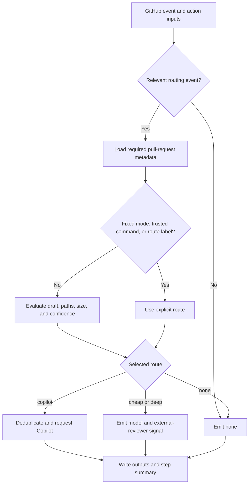

# SD GitHub Review Design

## Purpose

`sd-github-review` is a routing action, not a hosted AI reviewer. It selects the
least-expensive appropriate review level for a pull request and either requests
GitHub Copilot or tells a consumer-owned workflow which external reviewer to
run.

Deterministic CI, security scanners, branch protection, and human approval stay
authoritative. AI review is supplemental.

## Review Levels and Backends

| Route | Intended use | Action behavior | Backend status |
| --- | --- | --- | --- |
| `cheap` | Routine, lower-risk changes | Emits the configured cheap model and `run-external-reviewer=true` | Generic adapter plus executable PR-Agent workflow supported |
| `deep` | Changes that need a more capable external review, including high-risk changes in the PR-Agent profile | Emits the configured deep model and `run-external-reviewer=true` | Generic adapter plus executable PR-Agent workflow supported |
| `copilot` | Explicit native reviews and the generic high-risk default | Requests `copilot-pull-request-reviewer[bot]` through GitHub | Native integration supported |
| `none` | Review intentionally disabled or event is irrelevant | Emits routing evidence without requesting a reviewer | Supported |

Copilot is the only reviewer backend invoked directly by the action. The
`cheap` and `deep` routes are intentionally provider-neutral: the consuming
workflow owns the reviewer runtime, credentials, prompt, and model-provider
configuration.

The PR-Agent examples preserve that boundary with one provider selector, one
provider-neutral API-key secret, and separate cheap/deep model IDs. They map
the secret to one allow-listed single-key PR-Agent credential setting only on
the container step. The step invokes the digest-pinned CLI image with
`docker run` so the image retains its `/app` working directory; it passes
credentials by environment-variable name and mounts no repository workspace.
Provider expansion is an explicit workflow allowlist change; the router never
receives a provider credential or constructs a secret name. Providers that
also need endpoints, cloud identity, or additional configuration are outside
this generic mapping contract.

The `copilot` route is not a named-model selection. GitHub chooses Copilot code
review's model and does not expose model switching. GitHub separately offers
Low and Medium review effort, but the review-request API used by this action
has no effort parameter. Consequently, effort is neither selected per route
nor represented in action outputs or durable receipts. A repository that uses
GitHub automatic reviews for the same high-risk intent should normally choose
Medium at the repository level; router-initiated requests must treat model and
effort as GitHub-managed.

## Architecture

The implementation has six boundaries:

1. `src/router.js` contains pure routing policy, command parsing, label parsing,
   trust checks, and sensitive-path matching.
2. `src/protocol.js` validates and canonicalizes the versioned review request,
   adapter request, backend, acknowledgment, successor, and receipt envelopes.
3. `src/receipt.js` persists and reconciles exact-head receipts in GitHub Check
   Runs.
4. `src/operations.js` coordinates explicit `route`, `finalize`, and `query`
   receipt operations plus the side-effect-free `acknowledge` adapter helper,
   and emits bounded outputs.
5. `src/index.js` selects standalone or durable orchestration and owns GitHub
   output/error surfaces.
6. `src/github.js` owns GitHub REST requests, pagination, reviewer requests,
   comparison metadata, and Check Run transport. Consumer workflows still own
   external reviewer adapters for `cheap` and `deep`.



Irrelevant events and explicit routes are resolved before pull-request file
enumeration. This allows manual routing to work even for a pull request beyond
GitHub's 3,000-file listing window and avoids unnecessary API use.

### GitHub transport retry policy

The REST transport retries only `GET` requests, at most three total attempts.
Transport failures and HTTP 408/429/500/502/503/504 use deterministic bounded
backoff; HTTP 403 is eligible only when GitHub supplies primary- or
secondary-rate-limit evidence. `retry-after` takes precedence, followed by a
zero-remaining `x-ratelimit-reset`; a secondary limit without either waits 60
seconds. No individual wait exceeds 60 seconds. A longer GitHub directive
fails with bounded rate-limit context instead of retrying early.

Mutating requests are never retried. An interrupted reviewer request, Check
Run create, or Check Run update therefore stays within the existing
fail-closed reconciliation boundary and cannot be duplicated by transport
recovery. Terminal API errors preserve the GitHub message and append only
allow-listed rate-limit fields; authorization and arbitrary response headers
are never logged.

### Consumer installation lifecycle

Repository-only tooling under `scripts/` can provision the supported
event-driven PR-Agent workflow in a separate consumer checkout. The installer
copies the reviewed workflow unchanged, reconciles the bounded GitHub
variables and routing labels, and passes the provider credential only through
the `gh secret set` prompt or standard input. It never imports into the Action
runtime, commits consumer changes, or stores a secret value.

`.github/sd-github-review.json` is the consumer-side ownership boundary. It
records exact workflow/source hashes, provider/model configuration, and which
GitHub resources the installer created. `pending`, `active`, and
`uninstalling` states make interrupted GitHub mutations resumable. Updates and
uninstalls refuse to overwrite a workflow whose current hash differs from the
manifest; secrets and labels are preserved by default during removal because
they may have other consumers.

## Durable On-Demand Workflow

`operation=standalone` preserves the event-driven behavior above. A trusted
caller can instead provide one canonical v1 `review-request` and choose:

| Operation | Behavior |
| --- | --- |
| `route` | Revalidates the live PR head, selects policy, creates or reconciles one Check Run receipt, and performs at most one authorized dispatch |
| `acknowledge` | Validates one adapter request and maps a bounded GitHub step outcome to canonical acknowledgment JSON; it performs no GitHub or provider call |
| `finalize` | Validates one external adapter acknowledgment, revalidates the head, and advances that same receipt to failed or observed |
| `query` | Reads one exact repository/PR/head/logical identity and never dispatches |

The durable identity is derived from repository, pull request, full head SHA,
and attempt. Correlation IDs are aliases, not permission to dispatch again. A
matching retry returns the existing receipt; a conflicting fingerprint fails;
an uncertain mutation leaves the receipt in `reconciliation-required` with
dispatch forbidden.

`acknowledge` is a workflow helper rather than a receipt operation exposed by
setup discovery. It lets adapters such as PR-Agent record `success`, `failure`,
`cancelled`, or `skipped` without accepting provider output or unbounded error
text.

For Copilot, `route` checks both pending requests and non-dismissed reviews on
the exact head before requesting. For `cheap` and `deep`, it emits one bounded
`adapter-request`. The consumer-owned adapter writes findings to its declared
review, comment, or check channels and returns one v1 acknowledgment. Only then
does `finalize` complete the receipt. `none` records a skipped receipt without
reviewer mutation.

Every new head has a distinct identity. Optional `supersedes` data is verified
against the prior durable receipt and trusted GitHub comparison metadata. Raw
paths are used only in memory; receipts retain a digest, counts, and normalized
delta class. A bookkeeping-only successor may select `none` only in `auto`,
when explicitly enabled and no independent-review floor overrides it.

Both published on-demand workflows expose that trusted repository policy
directly. `rerequest-authorized` defaults to `false` and is enabled only for a
validated attempt greater than one; `independent-review-floor` defaults to
`none` and can require `cheap`, `deep`, or `copilot`. The two controls feed the
initial route/query operation and never alter the canonical finalization
identity.

[`config/routed-review-setup-v1.json`](config/routed-review-setup-v1.json)
declares the workflow identity, contract major, supported intents and
operations, Check Run capability, permissions, and immutable Action
placeholder. Read-only clients combine that declaration with GitHub workflow
metadata to classify `ready`, `absent`, `invalid`, `incompatible`, or
`unavailable` before any dispatch.

## Automatic Selection

The first applicable rule wins:

| Priority | Condition | Result |
| --- | --- | --- |
| 1 | Action `mode` is not `auto` | Configured route |
| 2 | Trusted exact `/review` command | Command route |
| 3 | One explicit `review:*` label | Label route |
| 4 | Draft and `review-drafts=false` | `none` |
| 5 | A changed path matches `sensitive-paths` | `high-risk-route`, default `copilot` |
| 6 | Changed lines meet `changed-line-threshold` (default `800`) | `high-risk-route`, default `copilot` |
| 7 | Upstream `confidence=low` | `low-confidence-route`, default `deep` |
| 8 | No earlier rule matched | `cheap` |

The router does not calculate semantic confidence. A preceding review or
analysis step may provide `confidence=high`, `medium`, `low`, or `unknown`.
Only `low` changes routing, and the configured escalation may be `deep` or
`copilot`.

This makes automatic routing a risk policy rather than a general model
ranking. Known structural risk or scale goes to `high-risk-route`; uncertainty
reported by an upstream reviewer goes to `low-confidence-route`; and ordinary
work stays on `cheap`. Both escalation inputs accept `deep` or `copilot`.
Generic workflows inherit `high-risk-route=copilot`, while both PR-Agent
profiles set it to `deep` so the configured external deep model handles
automatic high-risk reviews. Selecting `copilot` does not dynamically raise
GitHub's review-effort setting, and setting `high-risk-route=deep` does not
disable explicit Copilot commands, labels, modes, or durable requests.

Sensitive paths accept comma- or newline-separated glob patterns. `*` stays
within one path segment, `**` crosses directories, and `?` matches one
non-separator character. The defaults cover authentication, authorization,
billing, cryptography, migrations, schemas, and public API paths; consumers
should replace them with repository-specific risk boundaries.

## Manual Selection

There are three manual controls, ordered from strongest to weakest.

### Fixed Workflow Mode

Set the action's `mode` input to `cheap`, `deep`, `copilot`, or `none`. This is
the highest-precedence control and is useful for a dedicated workflow or a
temporary repository-wide policy. The default is `auto`.

### Pull-Request Comment

On an `issue_comment` `created` event, an authorized user can post one exact
command:

```text
/review cheap
/review deep
/review copilot
/review none
/review auto
```

Commands default to users whose GitHub author association is `OWNER`, `MEMBER`,
or `COLLABORATOR`. A consumer may change `trusted-associations` or allow the
pull-request author with `allow-pr-author-commands=true`. Untrusted or
non-command comments route to `none` without listing changed files.

`/review auto` explicitly returns the invocation to automatic policy and
overrides a route label for that event.

### Pull-Request Label

Applying one of these labels on a `pull_request` `labeled` event selects the
corresponding route:

- `review:cheap`
- `review:deep`
- `review:copilot`
- `review:none`

`review:auto` is a recognized routing event but does not select a backend. To
return a pull request to automatic routing, remove other `review:*` route
labels before applying it. Multiple explicit route labels fail visibly rather
than choosing an arbitrary backend.

The supplied workflow examples trigger on pull-request open, synchronize,
reopen, ready-for-review, and label events, plus newly created issue comments.
Consumers may narrow that event set. Removing a label does not trigger the
example workflow unless `unlabeled` is added explicitly.

## Backend Dispatch and Outputs

Every handled invocation writes a step summary and stable outputs:

| Output | Meaning |
| --- | --- |
| `route` | `cheap`, `deep`, `copilot`, or `none` |
| `reason` | Human-readable explanation of the selected route |
| `model` | Consumer-configured model for `cheap` or `deep` |
| `pull-request-number` | Evaluated pull request |
| `changed-lines` | Additions plus deletions reported by GitHub |
| `sensitive-files` | JSON array of matched paths when automatic path evaluation ran |
| `run-external-reviewer` | `true` for `cheap` and `deep` |
| `copilot-requested` | `true` only when this invocation created a Copilot request |

An explicit or disabled-draft route skips sensitive-path evaluation and emits
`sensitive-files=[]`. Empty cheap/deep model inputs are valid and delegate the
default-model decision to the consumer adapter. The PR-Agent examples are
stricter: their preflight requires a nonempty selected model before the
container starts.

A typical external adapter runs only when
`run-external-reviewer == 'true'`, then receives `route`, `model`, and
`pull-request-number`. Provider credentials belong on that adapter step, never
on the router step.

For Copilot, the action first checks pending requested reviewers. If Copilot
has already left a non-dismissed review on the current head commit, it also
suppresses a repeat request. The route remains `copilot`, while
`copilot-requested=false` explains that no new side effect occurred.

Durable operations retain the compatible route outputs and add the canonical
`receipt`, `receipt-id`, `logical-dispatch-id`, `request-fingerprint`,
`durable-state`, `receipt-verified`, dispatch status/phase, selected backend and tiers, finding
channels, limitations, workflow URL, latency, and reconciliation flags.
`adapter-request` is nonempty only for the first authorized external dispatch.
`adapter-acknowledgment` is emitted only by `operation=acknowledge`.
Durable mode exposes a sensitive-file count but never emits the paths.

## Security and Operational Boundaries

- Pin this action and external reviewer actions to full commit SHAs; pin direct
  container adapters to SHA-256 image digests.
- Grant `contents: read`; add `pull-requests: write` only when Copilot requests
  are enabled, and add `checks: write` only to a durable receipt workflow.
- Do not check out or execute pull-request-authored code with secrets in an
  `issue_comment` workflow.
- Keep provider credentials in the consumer-owned adapter step.
- Keep outside-contributor commands disabled unless their cost exposure is
  explicitly accepted.
- Run deterministic checks before AI routing and retain human approval where
  required.
- Setup discovery, durable routing, comparison, dispatch, finalization, and
  query are noninteractive and never check out or execute pull-request code.
- After an ambiguous side effect, query the durable identity and stop; never
  try a direct or alternate reviewer as fallback.

Durable operations deduplicate native and external dispatches across runs.
Standalone external routing remains a compatibility mode whose adapter
lifecycle is owned entirely by the consumer workflow.

## Planned Local-Attested Review Execution

Version 2 plans an explicit standalone `local-attested` route for repositories
that perform review locally and do not want Copilot, PR-Agent, or another
GitHub-side reviewer dispatched. The local `sd-review` lifecycle publishes one
bounded, authenticated, exact-head attestation; this Action validates it and
projects the stable assurance and gate Checks without creating a review,
comment, adapter request, or provider call.

This path is separate from `none`. `none` means review was skipped and supplies
no assurance. A local-attested clean result may satisfy assurance only under an
explicit repository trust policy. The receipt says `repository_attested` and
does not claim GitHub independently ran or verified the local model. Findings,
missing evidence, stale heads, failed/cancelled runs, malformed input, and
unauthorized publishers block the gate.

The planned contract and delivery split live under
`.trellis/tasks/07-25-support-local-attested-reviews/`.

## Related Documents

- [`README.md`](README.md) — installation and development quick start
- [`SETUP-COPILOT.md`](SETUP-COPILOT.md) — native GitHub Copilot setup
- [`SETUP-PR-AGENT.md`](SETUP-PR-AGENT.md) — standalone and durable PR-Agent
  setup, including the event-driven lifecycle installer
- [`scripts/install-consumer.mjs`](scripts/install-consumer.mjs) — safe
  install, update, check, and uninstall entrypoint for event-driven PR-Agent
- [`examples/review-router.yml`](examples/review-router.yml) — production
  adapter skeleton
- [`examples/pr-agent-router.yml`](examples/pr-agent-router.yml) — PR-Agent
  standalone adapter
- [`examples/pr-agent-on-demand-review-router.yml`](examples/pr-agent-on-demand-review-router.yml)
  — PR-Agent durable adapter and acknowledgment flow
- [`examples/pilot-router.yml`](examples/pilot-router.yml) — provider-free
  routing smoke workflow
- [`examples/on-demand-review-router.yml`](examples/on-demand-review-router.yml)
  — no-checkout durable dispatch and finalization workflow
- [`config/routed-review-setup-v1.json`](config/routed-review-setup-v1.json) —
  read-only setup capability descriptor
- [`docs/RELEASE_CHECKLIST.md`](docs/RELEASE_CHECKLIST.md) — candidate, pilot,
  and release gates
