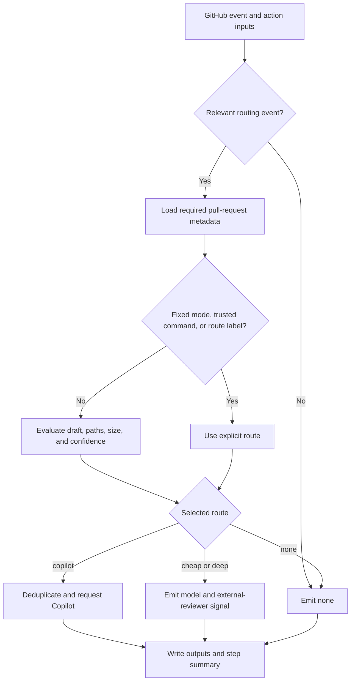

# SD GitHub Review Design

## Purpose

`sd-github-review` is a routing action, not a hosted AI reviewer. It selects the
least-expensive appropriate review level for a pull request and either requests
GitHub Copilot or tells a consumer-owned workflow which external reviewer to
run.

Deterministic CI, security scanners, branch protection, and human approval stay
authoritative. AI review is supplemental.

## Review Levels and Backends

| Route | Intended use | Action behavior | Backend status |
| --- | --- | --- | --- |
| `cheap` | Routine, lower-risk changes | Emits the configured cheap model and `run-external-reviewer=true` | Generic adapter contract supported |
| `deep` | Changes that need a more capable external review | Emits the configured deep model and `run-external-reviewer=true` | Generic adapter contract supported |
| `copilot` | Sensitive, unusually large, or explicitly escalated changes | Requests `copilot-pull-request-reviewer[bot]` through GitHub | Native integration supported |
| `none` | Review intentionally disabled or event is irrelevant | Emits routing evidence without requesting a reviewer | Supported |

Copilot is the only reviewer backend invoked directly by the action. The
`cheap` and `deep` routes are intentionally provider-neutral: the consuming
workflow owns the reviewer runtime, credentials, prompt, and model-provider
configuration.

### Planned Backends

The planned integration order is:

1. Live contract validation for the documented PR-Agent reference workflow.
2. A runnable Gito adapter example consuming the generic output contract.
3. A documented command or HTTP adapter pattern for internal review services.

Direct OpenAI, Anthropic, Google, or other model-provider SDK integrations are
not planned for the core action. Those providers can be used behind Gito,
PR-Agent, or an internal adapter without turning the router into a credential
broker. A backend is considered natively supported only after its adapter has
contract tests and a documented credential boundary.

## Architecture

The implementation has four boundaries:

1. `src/router.js` contains pure routing policy, command parsing, label parsing,
   trust checks, and sensitive-path matching.
2. `src/index.js` interprets the event, minimizes API work, invokes the policy,
   performs the selected side effect, and emits outputs and a step summary.
3. `src/github.js` owns GitHub REST requests, pagination, reviewer requests,
   and review-state lookup.
4. The consuming workflow owns external reviewer adapters for `cheap` and
   `deep`.



Irrelevant events and explicit routes are resolved before pull-request file
enumeration. This allows manual routing to work even for a pull request beyond
GitHub's 3,000-file listing window and avoids unnecessary API use.

## Automatic Selection

The first applicable rule wins:

| Priority | Condition | Result |
| --- | --- | --- |
| 1 | Action `mode` is not `auto` | Configured route |
| 2 | Trusted exact `/review` command | Command route |
| 3 | One explicit `review:*` label | Label route |
| 4 | Draft and `review-drafts=false` | `none` |
| 5 | A changed path matches `sensitive-paths` | `copilot` |
| 6 | Changed lines meet `changed-line-threshold` (default `800`) | `copilot` |
| 7 | Upstream `confidence=low` | `low-confidence-route`, default `deep` |
| 8 | No earlier rule matched | `cheap` |

The router does not calculate semantic confidence. A preceding review or
analysis step may provide `confidence=high`, `medium`, `low`, or `unknown`.
Only `low` changes routing, and the configured escalation may be `deep` or
`copilot`.

This makes automatic routing a risk policy rather than a general model
ranking: known structural risk or scale goes to the native Copilot path,
uncertainty reported by an upstream reviewer goes to `deep` by default, and
ordinary work stays on `cheap`.

Sensitive paths accept comma- or newline-separated glob patterns. `*` stays
within one path segment, `**` crosses directories, and `?` matches one
non-separator character. The defaults cover authentication, authorization,
billing, cryptography, migrations, schemas, and public API paths; consumers
should replace them with repository-specific risk boundaries.

## Manual Selection

There are three manual controls, ordered from strongest to weakest.

### Fixed Workflow Mode

Set the action's `mode` input to `cheap`, `deep`, `copilot`, or `none`. This is
the highest-precedence control and is useful for a dedicated workflow or a
temporary repository-wide policy. The default is `auto`.

### Pull-Request Comment

On an `issue_comment` `created` event, an authorized user can post one exact
command:

```text
/review cheap
/review deep
/review copilot
/review none
/review auto
```

Commands default to users whose GitHub author association is `OWNER`, `MEMBER`,
or `COLLABORATOR`. A consumer may change `trusted-associations` or allow the
pull-request author with `allow-pr-author-commands=true`. Untrusted or
non-command comments route to `none` without listing changed files.

`/review auto` explicitly returns the invocation to automatic policy and
overrides a route label for that event.

### Pull-Request Label

Applying one of these labels on a `pull_request` `labeled` event selects the
corresponding route:

- `review:cheap`
- `review:deep`
- `review:copilot`
- `review:none`

`review:auto` is a recognized routing event but does not select a backend. To
return a pull request to automatic routing, remove other `review:*` route
labels before applying it. Multiple explicit route labels fail visibly rather
than choosing an arbitrary backend.

The supplied workflow examples trigger on pull-request open, synchronize,
reopen, ready-for-review, and label events, plus newly created issue comments.
Consumers may narrow that event set. Removing a label does not trigger the
example workflow unless `unlabeled` is added explicitly.

## Backend Dispatch and Outputs

Every handled invocation writes a step summary and stable outputs:

| Output | Meaning |
| --- | --- |
| `route` | `cheap`, `deep`, `copilot`, or `none` |
| `reason` | Human-readable explanation of the selected route |
| `model` | Consumer-configured model for `cheap` or `deep` |
| `pull-request-number` | Evaluated pull request |
| `changed-lines` | Additions plus deletions reported by GitHub |
| `sensitive-files` | JSON array of matched paths when automatic path evaluation ran |
| `run-external-reviewer` | `true` for `cheap` and `deep` |
| `copilot-requested` | `true` only when this invocation created a Copilot request |

An explicit or disabled-draft route skips sensitive-path evaluation and emits
`sensitive-files=[]`. Empty cheap/deep model inputs are valid and delegate the
default-model decision to the consumer adapter.

A typical external adapter runs only when
`run-external-reviewer == 'true'`, then receives `route`, `model`, and
`pull-request-number`. Provider credentials belong on that adapter step, never
on the router step.

For Copilot, the action first checks pending requested reviewers. If Copilot
has already left a non-dismissed review on the current head commit, it also
suppresses a repeat request. The route remains `copilot`, while
`copilot-requested=false` explains that no new side effect occurred.

## Security and Operational Boundaries

- Pin this action and external reviewer actions to full commit SHAs.
- Grant `contents: read`; add `pull-requests: write` only when Copilot requests
  are enabled.
- Do not check out or execute pull-request-authored code with secrets in an
  `issue_comment` workflow.
- Keep provider credentials in the consumer-owned adapter step.
- Keep outside-contributor commands disabled unless their cost exposure is
  explicitly accepted.
- Run deterministic checks before AI routing and retain human approval where
  required.

The action currently has no bounded retry/backoff policy, and generic external
reviewers have no cross-run deduplication contract. Those remain operational
roadmap items to address from adoption evidence.

## Related Documents

- [`README.md`](README.md) — installation and development quick start
- [`examples/review-router.yml`](examples/review-router.yml) — production
  adapter skeleton
- [`examples/pr-agent-router.yml`](examples/pr-agent-router.yml) — PR-Agent
  reference adapter
- [`examples/pilot-router.yml`](examples/pilot-router.yml) — provider-free
  routing smoke workflow
- [`docs/PROJECT_PLAN.md`](docs/PROJECT_PLAN.md) — roadmap, risks, and success
  measures
- [`docs/RELEASE_CHECKLIST.md`](docs/RELEASE_CHECKLIST.md) — candidate, pilot,
  and release gates
